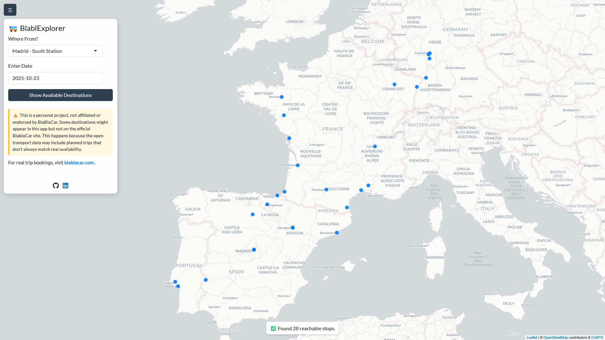

# **BlablExplorer**

**A Shiny App for Exploring BlaBlaCar Bus Routes**

------------------------------------------------------------------------

## **📌 Overview**

**BlablExplorer** is an interactive Shiny app that helps users discover all destinations reachable by BlaBlaCar Bus from a given starting point and date. Users can input their departure bus stop and travel date, and the app will display all available destinations. Clicking on a destination will offer to redirect users to the official BlaBlaCar booking platform for that trip.

This project was built using **open data from BlaBlaCar** and is intended for personal and educational purposes only.

------------------------------------------------------------------------

## **⚠️ Disclaimer**

-   **No Affiliation**: This is a personal project and is not affiliated with, endorsed, or supported by BlaBlaCar.
-   **Data Reliability**: The data used in this app is sourced from public datasets and may not always reflect real-time availability or accuracy. Some trips may appear in the app but not be available on BlaBlaCar's official platform. Always verify trip details on [BlaBlaCar's website](https://www.blablacar.com/).

------------------------------------------------------------------------

## **🚀 Features**

-   **User-friendly interface**: Input your starting bus stop and travel date.
-   **Direct booking links**: Click on a destination to book your trip on BlaBlaCar’s official platform.
-   **Open data**: Built using publicly available BlaBlaCar Bus data.

------------------------------------------------------------------------

## **🛠️ Technical Stack**

-   **R & Shiny**: For building the interactive web app.
-   **Data Cleaning & Processing**: Joined tibbles. Handled geospatial data.
-   **Deployment**: Hosted on [shinyapps.io](https://www.shinyapps.io/).

------------------------------------------------------------------------

## **📂 Data Sources**

**BlaBlaCar Open Data** on [transport.data.gouv.fr](https://transport.data.gouv.fr/datasets/blablacar-bus-horaires-theoriques-et-temps-reel-du-reseau-europeen).

------------------------------------------------------------------------

## **📱 How to Use**

1.  **Input your starting bus stop** (e.g., "Paris").
2.  **Select your travel date** (e.g., "2025-12-25").
3.  **View all reachable destinations** on the map or list.
4.  **Click on a destination** to be redirected to BlaBlaCar’s booking page.

------------------------------------------------------------------------

## **📊 Screenshot**

------------------------------------------------------------------------

## **💡 Future Improvements**

-   Increase the reliability of the shown destinations.
-   Automatically update the data periodically.

------------------------------------------------------------------------

## **📜 License**

This project is open-source and available under the [**MIT License**](LICENSE.txt).

------------------------------------------------------------------------

## **📬 Contact**

For any questions or feedback, feel free to reach out by [email](mailto:lorenzo.dufour@protonmail.com) or on [LinkedIn](https://www.linkedin.com/in/dufourlorenzo/).
